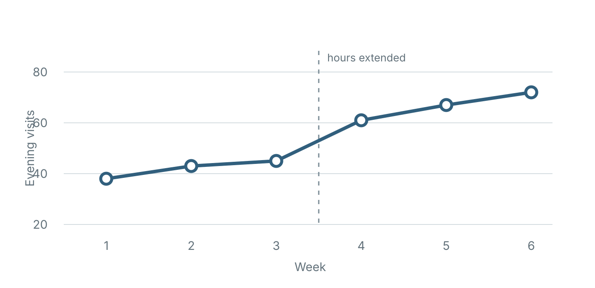

## One slide, one beat {.statement}

Use the space to make the argument move.

## What must the audience understand? {.question}

Write the question before adding supporting material.

## Ordinary text

Keep prose brief enough to say aloud.

- Lead with the important point.
- Keep only evidence that changes the audience's understanding.
- Move qualifications to notes or an appendix.

## A short interpretation can breathe {.center}

If one sentence carries the interpretive turn, let it sit in the middle instead of padding it with bullets.

## Columns are for a real comparison

:::: {.columns}
::: {.column width="50%"}
### Before

Name the baseline in one or two lines.
:::

::: {.column width="50%"}
### After

Show only the difference the audience needs.
:::
::::

## A useful quotation {.quote}

> A slide is a beat in an argument, not a rectangular container waiting to be filled.

::: {.quote-source}
Design principle for this template
:::

# Evidence should change the argument

## A figure earns the space {.visual}

{#fig-placeholder fig-alt="A line rises across six weekly observations."}

## Equations are visual objects {.math}

$$
\hat{\beta} = (X^\mathsf{T}X)^{-1}X^\mathsf{T}y
$$

Define only the notation needed for the next step.

## Code stays readable {.code}

```python
def moving_average(values, window=3):
    """Return complete-window moving averages."""
    return [
        sum(values[i - window + 1 : i + 1]) / window
        for i in range(window - 1, len(values))
    ]
```

## Tables show comparisons

| Form | Best used for |
|---|---|
| Statement | One important claim |
| Visual | One figure and its takeaway |
| Code | A short, legible excerpt |

## End with the point {.statement}

Delete before shrinking, decorating, or complicating.
